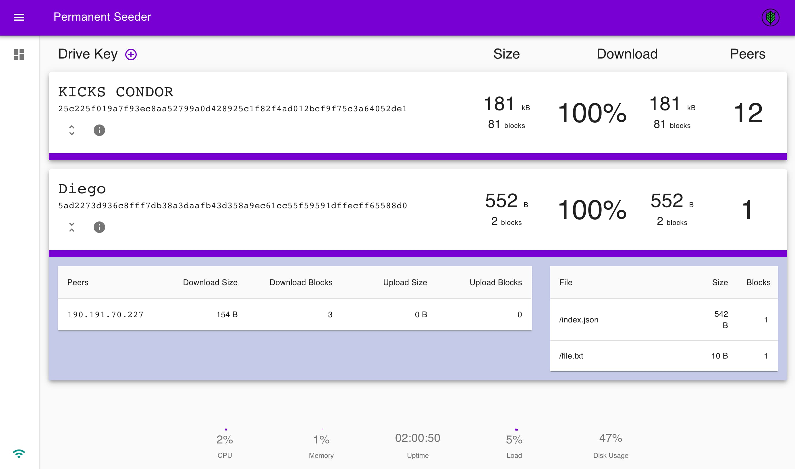

# permanent-seeder

[](https://travis-ci.com/geut/permanent-seeder)
[](https://standardjs.com)
[](https://github.com/RichardLitt/standard-readme)

[![Made by GEUT](https://img.shields.io/badge/Made%20by-GEUT-4f5186?style=for-the-badge&link=https://geutstudio.com&labelColor=white&logo=data:image/png;base64,iVBORw0KGgoAAAANSUhEUgAAAEAAAABACAYAAACqaXHeAAARWElEQVR42tVbCVBb95m3PE636WaabNZp08SJvQmHAeMLg8FgLAzmEgJ0PEnoAl+E0zG+147Bt4nBHLqw0IVTp8l6HCc+JMRhcDudnW432e203XTbejNJmnanG8ebNImbTaz37fd/T0ISejogYDua+ebpeHp6v993//+f5sy5Lx68++U6vOlfDPALALw5ba1zmSMjM4bsLhM51Qu1tc2VuPpWiJ2GXPHVnjxylDj1qyTDvfGV492PcFyYd5cBzS7jbUiAYtzyb7Jhk0c+esYjG+mjKbeRyBfyYdMtfO8GPndJXfojlNOwQXilc/69Q8ebCdZDzuEhuH5qyERTgwZgwA8aaCkKHj2MuPH5UB9NyJENmT6WjZgGpS6dlhppf/ibou6IDwSjko/0eRgCooiPGHI+Ws2H0iFjF7rNwsgk3Of8UJd6ElHzd7zgIFZhznebaPlw3ydSt6GdGjE/PPtoeTN+ER6/rW2efMT0LjVIfJ+4AeMK7HECML526cMTgS4kGza+I3abCmYOGG/WqeTx+ePzyilrXNGJEz/P3b+fztq6CzJULZCubIHMTTth7a59UHDyEJTZXwTJ5V4/cA4yCBGy4b7/o1yGVhJc7+vwL1GeiRcrLW1U9cC/S7V2T1buPjouTgPxyVqITwmQBC3EPauGuDgtLF6xEVYWNkP+iUMgeq3HayH6MNZgstS+aX7gfkqVzK+J1faVEo3jglRj/yuFwCVqq0esstKFlR0Ql6SGhCXVkWVpNcQt0kDiso2QWbMDys91clkEyRYkpdra4J5ZQrCfUxrz01KN4xwC/1KittEENIIHImJ1P1RUmSBhWU10AnySWs1YSEJiNWSqdoLoQreXCD8JjCUMmY7eo3J4otSbK1L111Eaxy2pxuYJBD5ZUtPrAkBqYyaDuM3ipZugoP0wSAMsgY0Jxq8kLp2QLa3vcjoUKE1/h6DPSzR2OhJwn2Tm72W1GqsVTHKNpKRNIH69J8gdWBJMH4guGv7+rto/MXmJxvpronUEFxU8kYLKdohLVrPBLyAYJqRUR7YMdIfExTVQ5jjFXTOgK0iHDL13K+rxSFpDX3+PBLhYgPukQtkH2fkHILekDdaVHoK1ha2QlbcPVq7bBskrt0D8Eg0kJGtDwCckV0Ox/nhIRgiygpG+TytdumdnnYQKhfEpBP8ut8nbIMp7tJQhzUYTweswIlGjC6n7PaWyHjqrcC8kLt844SrxiVrIP3ooeuWIPYZsyNAdnYCvwQ9FGR/CG38LTT9GzbPgWbLsNKV13KG0Z/+Ax59KVJaX8bMeicrWK1XbrlLagfdYMmw0Wgqdkb+bjk/Q0Lk799OTon94Kxgy/g81bnwoBiMOYAF4MbOCIPR4kzGbPQHOatnxrkhlPSZR2Fbxaxzf9lWJgZJFdT0oVlpzpWr7D1FuS7UDdOGmFwcxzX0U2kMYuUggwRC7TJ04dEEGeIFghZ3j8wU9I0WCntHWcuOPx0p6RrZGBS9W2bJJjo8l2k+Yu9bxv6jRHUKh+TssUODFVEwpbc+I1Zb9hCzxZV0mNkO3pIPGqI2UzG30oBWc8wOew0tuO/8tQfdIkqB3VCHUjZ0RGq6/hcfbZfpxutxw3YPv02W6sVejLevMRSA/DY724f2dzQy2X1Fqa9w0nY4XqD2JS18pG+q7Q0XqJt2Mm2DL3XejuGcwp7RnpEWou/YGavgdoX78Szx6ynSjNAHMgGYFyBE//0WkfoYnUfYXoRnTsaQ7L/i3RNqzM5qXkYB+1C7nmoLwlW5YUd8KCdQ+eIrfQhd3OEGov46AryHIEU8AWC7x4Lkf8dvG54XVBtb2zlhMn/V525/KFbYnZjgb8SqGTj9FDRs+DYkHLiOUneuCJ3NaYMG6HfBE9nbIPfBSJMBBImAsYOzzEp3rMU5rFStNzyCoL2PQPhPpRUpLRQy+Pr0s5Da97F1SC84ATj0sKt7FEECIyGjugykRoLv2RXH34CJOAkQaa4vX/CPmeMb0NXb3jBcizJI664sIVqQYNXtk7tAssFj+j7AgFwlY2wIrt+oR3LWYCSjTj30h6Bp5hnNBk+TsGMyfLWaU5rwZ1fj55sfkrobLcmf9Fbmz8Yr4Yv1YxhE5nd4mgfwz24MISN34gp+ALbopWsDY7aJu9w9CCBBWmedLtfaPopW8jO9rHb/h89vmcRQcvOlaBeVsSpUPNtIyVwMjkkt1dEozH5KbciGnY1NQBkjd7Ccgrc4QMwHeIPiJ8NCV74Saf5UtR1Y9EEPhQ/p/S1AZKnfVN8tdjS+jnFMMNv1Icql+6VQJkF9tVCiGmmi8BsicDSB5ow6SGnNR1kJu93NBFpCs3s8SgDEga6clAuBroRZguH6D8wawz9+KLuCJVu/Lqs96KlX9JYG7O6g5h8KNN+9upAkIytl4ekrbYXiufKjpArEAQgC6AFS8uhkW1+fA4oZsKLTtDSIgrnwPmwXWbIf1R16Fsp4YLUBHYsC4m7v601h1bOMS2fwlGtsXk4oeHlpAq9ynPTTfqqHmm5Sz4fFYd1eI+SuGm2+T7zIEoOSbqhjtJzetBdHrney6APYIotd74en1OxkCnlq/A0o6XYClbowEYK3QM3qKM3PJtGd/FEP682Dd/ieKOv9gsP82FPvMlxHUpMLd/Bp/nD8vKvjzDQ+h2/wLfs//fZT01lLG/9PbpAFL6QYosnbAD1a3MC6QKDk8Ff+HcuNPPKW9o8XcQUjrcEezAEIAusBvg8pHNN/K8e2PIAE3JzRITNlNpMlOAIbrTYVXaucjUYNIgGcCPJp/5fktDPikhhwo/WGrd22A3VtY2dzGBD9SBGXvsU0CORItBX5c3jP6fU4LwPw/HokADHwsAdqBNxkwbW1zS3Q/+y7fOP4Q4wbuJj3GAU+wFeBrd9N/UM56JeXe/GiaufaB2jdrHyDugefUI2nvTwZPjquPCJkAmHFYHlAFGkB8SQcLN7BF0KINe6C0axD93w9a0DNMzJx9L9QtMACODYYt3CiNY5ibABsDvlxuhBJRN80vP/nf5aafDGB39a/YWX0m6B0zEjLEr21ZoBhq/ijQj30xgbgHAr2Nx9+jvKMYbPySvDf5XCIFZ4jvr4PUlnzW9wOCX86RYxj4UPtMBWjyg0OwpV1DsHz9bsikTsKGF14FQaebJcPfBNGl3cNVYXsxJOAyGwP8kV8g6YUVmdsgecVWSFhSA3EpGkhaVUdjb+3tskY8WFh8WNT1z48SEjCYKYnWOYBN5HefBH3u1fwGsxJNfx2kbOOD4JVDQTtHlRd7YWEBq/1nSvcjYHeQlvnbbRC/WA3xS8jmiwqS02ohvawV8p63QWmHi0T/PzDWGm6XCaO7OdgCiNZNIYuWick1UHzisv/H9WOEkMM+KtH0d4chIYw0gOjCVsg6LmSifuqOAih75UiQ6ZMYsOy5FxjfJ8Jve8Xv715zX5q7nXOvgZCSmFJN54lOfSDV9O8sV1hXkJY/xAREauteUuJOdoFl6Y1BF46LU8H6PS9N3ADbYY1/KuwaS/FdjPh81XDzTeLfDBGDjZxkCF7aOBHtkxpzIPOYEkRvnA5ZDVp7/DgGvRam8ElvMIYUOnktDgZouGV2ss9QoTCTZToP9jFfYSX7O4nKYhArbQWVNY5HmPsWq60Crkowr/goMqnxb1ygpKFphUbYa2+T5SdfOUxdqXsSY4IJwf+FSZGEBGejhxEXeyx21NBLWgpgTbsGhP90bNLuMft8fXc7ap0te5dWnwoOcHgUdA/DktVN7Ioy10YLWkFOwcHgWsa7WEtpB5AQx58pzUDrHCFl+Qe0gNuTm6EKRR8kpm4MdgN8XdJ+NcgHsc3EeHDt56WnnI8zkdZbCYou1n2PctZpsLw9qxp7/mfK0ef/s2p02w18/iu5+/lRqUv/OdP2Bu4HesHnnjgBC7zgU7Wn2IJnUnTPqemF+CRNWO2T+CVSmsOmdm/1W8kshWEx9DZXM5S5LniXJz5ZA6vlJ0NyLSEBI+97Zb3D+YHLTIE1AxMsz1PfYl8DT37tzI+94zPerTAjU+0trz8IT2a3eBsePQM+qOLD50VHLqJ/h9+DJPe8QfgiE8/CVbZIwA1hrZltjiRK6+nQONAPQkof+gMp1VB46EKIRryrLnew63pN0HttjTfq8gInyRjxjtBJXLpWZqTGzZa52YePYY7fxYBfVLgX1h045w92AeAFp4dgWc72iOAzcndH2bsg23yWnRP3Vqm0ZngJCAmGWfx9eNHgH0nN3oY34uYuOnrRJQgRhutvY/3dW9o1Iis77V62QT/8hNA8Pl/YeWU+6cuFAwOb13efopc9d5BeWLAby9ztsDB/F2pdByWnB0OrOu9vZUqOM1tuwcD9r5ek1UFllTmK9u1/pCjzwxMEpKWZH6CqB37J5QYkFiQt2xz0I+QG0oQHw1Ve4F2g9JBUKTSMk1aU9rrJZ3j8FLuzOxg86afzdjM5fjF1BDJ39ENxpzNU6wGvc7Q9Ef1+McaoMqkuLHh2VcvuESmtLSF7/2KlpTa0LfZueJadDNnxJTeSLjrKGaA4uzH/MjUr2KKSjq60eyg4t4fRfG6NLnRPcZIUVXTEsonzmwnfD9kS09rfD7c0NjkgsiSgJQhegNLOwegkcEk08shn3SOQXdUBCRE0TyRfcDLygg67mu2RaPqLIuwM9TeHBkMbY1L4GSzPaA7Z2iakkHy8ofV8eC1Ohxg8lp68CqsK9zPZJxS0NgD8CYhlLwNzvy1ik87nO74t0djf4rYCCwaXM5C6qoFbC2ieq2UnoORF5/SJ8H0Hi5y8+n6MPVsjTpmQuqSw4lSYHazJCzr2/6Io66NRV2lEVeYcjAVh9wdJUFye0cQ5BcKMuWDAXC1rZ3I1p7lzCbtsBYKOQchrtMDSrG1Y4kYyeS2krKzFpq0nps1brPw+I5ku5oVbsdrWztUf+ESE7pCxdlfYURi2GdHCUszXWdWnIX/POSjpcDKxguRxAbaw5IjdGhQfewP4jf2QLmxjqre4xMhTZuTa6Tk7GWuMFO395a+NxnJ/y5RWrUtKdH+D0fK6NOyMgIWR9aXHmYYjgSGCe+yF+C8BFZ+ILfXyLZCSUY8xowFSVtUzaSs+AT9LYkdqwtX1PuDJ+P2CsvbYplW88wpIwtFpDU9gpbRAigVDtA0T4hKrc/dM3GSs43ExT4/hNYmvZ68/4C1wYgPvnVno/jq7WDyR/Mwy7Jg+jGXTVCgzYKrcxxRNcUzUnuakmK/9xmsQjRPgFQoTTGVgwzua0xl2ESQ8J5M/ADYoVg98HJ0E1h9JB0YakYy1uyFlRS2jQQKGtNYTE2OBVaX3PXIOEeImq7J3MNfwd3OWqUyrfIU9/4EZnRCtVNkKYyMhmAyxsp/RHqnQ1hUdhjWozYycXQzAtDXbUVqYYEq0TOIJKWMJaIw9MYMOXLlGa70lVVqp2RiX5Uk05tVStf2P3uGI2IlQTQWIZcrAJ2aU1NY3y9W2xNn80wWPDEVIySpyjFOj4cdspiM2jt1qonXHZ2K15RBFdT14Vwan+fzWeRKVrRGJuDl5YHr2xBYCnHR1lMburFCdSb4n/6cppRyP443opVrHX7z5lo51nHY6EhDd76AFjs3wnML0U2WZxvw03twJvLEP2CkTn1XY6K9p4hMLmeyqrv0TrFDPkVg0W+M50yWDXQ1GH5RorELyfwK84fdZMuwBhJA/Vdi8VuIjh33tX7H1jdgyRQzR9i2pdsAlqrJspCj7Y6EToLOKb7q/Q/MKNR1/K1abV4o0lm1Ylb2MgeoXCOTPEo3tc9Z/CbgB2mcxmFn+ip/fxKblt1K17RIGtYOVagvf273di//L8b7u+SEjM2QitFLRt0iisK5AjWeLqvrXkemUSqUlrbLa/GyJSvddjgvy7gFw3iz/AHilda7/+Tf8X6Pf5Pv/f+V1Y8RS5eXNAAAAAElFTkSuQmCC)](https://geutstudio.com)

<div style="text-align: center">
  
</div>

## <a name="install"></a> Install

```
npm i @geut/permanent-seeder
```

Or from a [tarball](/packages/cli/dist) :package:

Alternatively you can `git clone` this repo and build it from source:

```
npm i
npm run bootstrap
permanent-seeder stop
permanent-seeder start
```

## <a name="usage"></a> Usage

First, create a base config file, you can tweak it later ;-)
```
$ permanent-seeder config:init
```

Then, start the Permanent Seeder daemon
```
$ permanent-seeder start
```
:rocket:

## <a name="commands"></a> Commands
```
$ permanent-seeder [COMMAND] [--OPTIONS]
```
### Config
```
$ permanent-seeder config:[init|get]
```
- `init`: creates the base config file for the Permanent Seeder. This is a `.toml` file that will live in `~/permanent-seeder/settings.toml`.
- `get`: returns the settings from the CLI. Useful when you are changing values and want to be sure they are pick up by the Permanent Seeder.

Default settings:
```toml
# Permanent seeder path (will be completed on config:init)
path = 'permanent-seeder'

# Enable stats recording
save_stats = true

# keys.endpoints = array of configs per endpoint
[[keys.endpoints]]

  # Where to fetch keys
  url = 'http://localhost:3000'

  # Frequency between fetchs (in minutes)
  frequency = 5

  # Hook to parse response
  hook = 'endpoint-hook.js'

## To add another endpoint, uncomment and complete next lines:
# [[keys.endpoints]]
#   url =
#   frequency =
#   hook
```

### Start

```
$ permanent-seeder start
```
Bootstrap a Permanent Seeder instance that will keep up running in the background. If you change settings, you will need to call `start` command again.

### Status
```
$ permanent-seeder status
```
It will return instance status. If it is running and some basic stats.

### Stop
```
$ permanent-seeder stop
```
Stops the current instance.

### Dashboard
```
$ permanent-seeder dashboard
```
Opens the dashboard app in a browser. If you want to manually access the dashboard, it can be found in: `localhost:3001`



### Key Management :key:
```
$ permanent-seeder key:[add|remove|remove-all]
```
- `add`: Insert a new key Permanent Seeder db, it will start downloading and seeding ASAP.
- `remove`: Removes a single key from the seeder db and also stops seeding it (e.g.: no more announcing to other peers)
- `remove-all`: Removes and unnanounce all the keys in the db.

### Logs

```
$ permanent-seeder logs --[live|all|error]
```
- `live`: like doing a `tail -f` of the logs.
- `all`: Show all the logs stored.
- `error`: Display only error logs.

### repl
```
$ permanent-seeder repl
```
Useful to inspect the Permanent Seeder under the hood. :microscope:

## Keys Endpoint

The Permanent Seeder can `fetch` keys from an external endpoint, i.e: perform a `GET` request against a particular endpoint. This can be useful if you maintain a service that stores hyperdrive's keys. If that is the case, then the Permament Seeder can fetch those keys regularly. You can think of this like a cron job.

Whilst, we internally expect an `Array<{key}>`, you can customize and parse the fetch response the way you need it.

To do this, you will need to modify `$HOME/permanent-seeder/endpoint-hook.js`.

That hook will be called after `fetch` the response.

You can also tweak the fetch `frequency` (defined in **minutes**) and the endpoint `url`. These options can be found in the `settings.toml` file:
```toml
[[keys.endpoints]]
url = "http://localhost:3000"
frequency = 5
hook = "$HOME/permanent-seeder/endpoint-hook.js"
```

## Design

The Permanent Seeder is a CLI tool that can starts a daemon which will [seed](https://en.wikipedia.org/wiki/Seeding_(computing)) [hyperdrive's](https://hypercore-protocol.org/#hyperdrive) keys that you pass into it.
Using the CLI you can add, remove keys, check the status and inspect logs.

It also contains a [`dashboard`](#dashboard) that you can use to have a visual reference of what is going on with your hyperdrives.

As you can see the project does a couple of things. To do this we decided to use a microservices based approach. We choose to use [moleculer](https://moleculer.services/) as the structural framework behind the Permanent Seeder. This enables multiples processes to communicate each other and at the same time each of these will have a single responsibility/scope. This also give us some room to scale things up if needed.
:sunglasses:

## <a name="issues"></a> Issues

:bug: If you found an issue we encourage you to report it on [github](https://github.com/geut/permanent-seeder/issues). Please specify your OS and the actions to reproduce it.

## <a name="contribute"></a> Contributing

:busts_in_silhouette: Ideas and contributions to the project are welcome. You must follow this [guideline](https://github.com/geut/permanent-seeder/blob/master/CONTRIBUTING.md).

## Built in collaboration with Liberate Science

<a href="https://libscie.org" rel="nofollow">

</a>

## License

MIT © A [**GEUT**](http://geutstudio.com/) project
