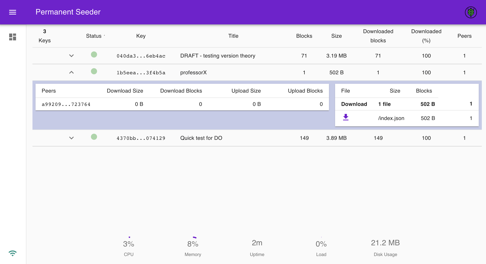

# permanent-seeder

[](https://travis-ci.com/geut/permanent-seeder)
[](https://standardjs.com)
[](https://github.com/RichardLitt/standard-readme)

[![Made by GEUT](https://img.shields.io/badge/Made%20By-GEUT-4f5186?style=for-the-badge&link=https://geutstudio.com&labelColor=white&logo=data:image/jpeg;base64,/9j/4AAQSkZJRgABAQAAAQABAAD/2wBDABALDA4MChAODQ4SERATGCgaGBYWGDEjJR0oOjM9PDkzODdASFxOQERXRTc4UG1RV19iZ2hnPk1xeXBkeFxlZ2P/2wBDARESEhgVGC8aGi9jQjhCY2NjY2NjY2NjY2NjY2NjY2NjY2NjY2NjY2NjY2NjY2NjY2NjY2NjY2NjY2NjY2NjY2P/wAARCABAAEADASIAAhEBAxEB/8QAGwAAAgIDAQAAAAAAAAAAAAAABAYDBQACBwH/xAA0EAACAQMBBAcGBgMAAAAAAAABAgMABBEFBhIhQRMiMVFhgcEUIzJxkbFCUmKh0fAkcuH/xAAYAQADAQEAAAAAAAAAAAAAAAABAwQCAP/EACARAAMAAwACAgMAAAAAAAAAAAABAgMRIRIxBEEiM1H/2gAMAwEAAhEDEQA/AOgVlau6xoXdgqqMkk8AKV9U2oYs0WngBRw6VhxPyFamXXoDeiz1PUbmzuujQIUKgjIqGLXnz72FSO9TikfVbi6uXWSSaWRuzixNBx3VzCepNIvgTw+hpjwv+iGr3tM6xa30F2PdP1uangRRNc70fUbi4JLIVaPskXgM/wA076Ze+2W+WwJF4MPWlNaemajI2/GvYbWVlZQHCptZqLNKLGJsKoDSY5nkKorKzlvrlYIRlm5nsA7zWX8pnv55SfikJ/emPZGDcs7m6CguTuL5DPrVf64Me2F2mzNhAg6ZTO/MsSB9BW15s1pt1GVEPRHvQ+hqbTNT9sZ0kCpIOIA5ij5ZEijaSRgqqMkmpVkb7sMuWtoV73S49L3I4B7kjq57c881BZ6vFpuoKjq7dIvYBw8PtUOqX1xcSxoJXw8mQuewVW3vX1eFR+Fcn96OLVvpFzz8kM020kp4QwIvixzVpot5Je2bSTEFw5HAY7qUKadnIymm7x/G5I+3pTskzM8G4rqq6JGpI8E1wi8HR2H0NT7P6rcRKUEzYR9/czgEf0VabV2JgvhdKPdzdvg399aVG37K4Esfw/3hTU1S2NpNrSHqax9q/wAzTm3lY5KA4ZTQl2mo9CWljncL+cnA+tVVhqeSGt5mik5qDg/9o+XVb6aFonuDusMHqjP2qavjbfGTPX3xgTstrm4uGDSEYVV+woWPMKy3dzwd+JHcOQrdkgtyZpXJb87nJ8qqr68a7cKgIjB4DmadGNQjohs9i1C66Xqtvbx+EjIp10jaOMLBaPasDwRTGc5PyNJ1rb9EN5/jP7U17KaaZJvbpV6icI88z3+VG0vH8ipJJ8Ga8tIr22eCYZVh5g94pC1TTJtPmMU67yH4XxwYV0So54IriIxzRrIh7QwzSIyOTbWzlElkCcxtjwNedHeKMCVseDmnq72UgkJa1maL9LDeH81XvspfA9WSBh/sR6U9XD+zDQp+yTSNmR/MnJomG3SLiBlu80zQ7JXTH31xEg/Tlj6Vb2OzljaEO6meQc5OweVc8koOmUGjaFLfuss4MdsOOewv8v5p0ijSGNY41CoowAOQrbsr2p7t0zSWj//Z)](https://geutstudio.com)

<p align="center">
  
</p>

## <a name="install"></a> Install

```
npm i -g @geut/permanent-seeder
```

Alternatively you can `git clone` this repo and build it from source:

```bash
# install deps
npm i
npm run bootstrap

# build the dashboard
cd packages/dashboard
cp .env.example .env
npm run build

# start the seeder
cd ../cli
./bin/run stop
./bin/run start

```

## <a name="usage"></a> Usage

First, create a base config file, you can tweak it later ;-)
```
$ permanent-seeder config:init
```

Then, start the Permanent Seeder daemon
```
$ permanent-seeder start
```
:rocket:

## <a name="commands"></a> Commands
```
$ permanent-seeder [COMMAND] [--OPTIONS]
```
### Config
```
$ permanent-seeder config:[init|get]
```
- `init`: creates the base config file for the Permanent Seeder. This is a `.toml` file that will live in `~/permanent-seeder/settings.toml`.
- `get`: returns the settings from the CLI. Useful when you are changing values and want to be sure they are pick up by the Permanent Seeder.

Default settings:
```toml
## Permanent seeder path (will be completed on config:init)
path = 'permanent-seeder'

## Enable stats recording
save_stats = true

## [optional] Preferred swarm port
# swarm_port =

## [optional] Api service settings
# [api]
# port = 3001

## [optional] HTTPS certificate and key
# [api.https]
# cert = "/path/to/cert.crt"
# key = "/path/to/cert.key"

## keys.endpoints = array of configs per endpoint
[[keys.endpoints]]

  # Where to fetch keys
  url = 'http://localhost:3000'

  # Frequency between fetchs (in minutes)
  frequency = 5

  # Hook to parse response
  hook = 'endpoint-hook.js'

## [optional] To add another endpoint, uncomment and complete next lines:
# [[keys.endpoints]]
#   url =
#   frequency =
#   hook
```

### Start

```
$ permanent-seeder start
```
Bootstrap a Permanent Seeder instance that will keep up running in the background. If you change settings, you will need to call `start` command again.

### Status
```
$ permanent-seeder status
```
It will return instance status. If it is running and some basic stats.

### Stop
```
$ permanent-seeder stop
```
Stops the current instance.

### Dashboard
```
$ permanent-seeder dashboard
```
Opens the dashboard app in a browser. If you want to manually access the dashboard, it can be found in: `localhost:3001`



:warning: Note: The dashboard app runs in `http://localhost:3001`. If you deploy the Permanent Seeder on a server and wants to access the dashboard from the outside, you would need to setup a reverse proxy.

<details>
  <summary>Sample nginx reverse proxy config</summary>

```
upstream dashboard-nodejs {
        server  127.0.0.1:3001;
}

server {
	listen 80 default_server;
	listen [::]:80 default_server;

	server_name _;

        location / {
                proxy_pass              http://dashboard-nodejs;
                proxy_next_upstream     error timeout invalid_header http_500 http_502 http_503 http_504;
                proxy_redirect          off;
                proxy_buffering         off;

                proxy_set_header        Host                    $host;
                proxy_set_header        X-Real-IP               $remote_addr;
                proxy_set_header        X-Forwarded-For         $proxy_add_x_forwarded_for;
                proxy_set_header        X-Forwarded-Proto       $scheme;
        }

        location /socket.io/ {
                proxy_pass              http://dashboard-nodejs;
                proxy_redirect          off;

                proxy_http_version      1.1;

                proxy_set_header        Upgrade                 $http_upgrade;
                proxy_set_header        Connection              "upgrade";
                proxy_set_header        Host                    $host;
                proxy_set_header        X-Real-IP               $remote_addr;
                proxy_set_header        X-Forwarded-For         $proxy_add_x_forwarded_for;
        }
}
```
</details>


:warning: Note2: We use the `.env.example` file as a placeholder for some environment variables that we use internally, like `PUBLIC_URL`. For **development** there are a few others variables that you can tweak, like the `SOCKET_URL` and `API_URL`. Checkout the full `.env.example`:

```
PUBLIC_URL=/

## Extend eslint config
EXTEND_ESLINT=true

## Optional ENVs only for development
#REACT_APP_SOCKET_URL=
#REACT_APP_API_URL=
```

### Key Management :key:
```
$ permanent-seeder key:[add|remove|remove-all]
```
- `add`: Insert a new key Permanent Seeder db, it will start downloading and seeding ASAP.
- `remove`: Removes a single key from the seeder db and also stops seeding it (e.g.: no more announcing to other peers)
- `remove-all`: Removes and unnanounce all the keys in the db.

### Logs

```
$ permanent-seeder logs --[live|all|error]
```
- `live`: like doing a `tail -f` of the logs.
- `all`: Show all the logs stored.
- `error`: Display only error logs.

### repl
```
$ permanent-seeder repl
```
Useful to inspect the Permanent Seeder under the hood. :microscope:

## Keys Endpoint

The Permanent Seeder can `fetch` keys from an external endpoint, i.e: perform a `GET` request against a particular endpoint. This can be useful if you maintain a service that stores hyperdrive's keys. If that is the case, then the Permament Seeder can fetch those keys regularly. You can think of this like a cron job.

Whilst, we internally expect an `Array<{key}>`, you can customize and parse the fetch response the way you need it.

To do this, you will need to modify `$HOME/permanent-seeder/endpoint-hook.js`.

That hook will be called after `fetch` the response.

You can also tweak the fetch `frequency` (defined in **minutes**) and the endpoint `url`. These options can be found in the `settings.toml` file:
```toml
[[keys.endpoints]]
url = "http://localhost:3000"
frequency = 5
hook = "$HOME/permanent-seeder/endpoint-hook.js"
```

## Design

The Permanent Seeder is a CLI tool that can starts a daemon which will [seed](https://en.wikipedia.org/wiki/Seeding_(computing)) [hyperdrive's](https://hypercore-protocol.org/#hyperdrive) keys that you pass into it.
Using the CLI you can add, remove keys, check the status and inspect logs.

It also contains a [`dashboard`](#dashboard) that you can use to have a visual reference of what is going on with your hyperdrives.

As you can see the project does a couple of things. To do this we decided to use a microservices based approach. We choose to use [moleculer](https://moleculer.services/) as the structural framework behind the Permanent Seeder. This enables multiples processes to communicate each other and at the same time each of these will have a single responsibility/scope. This also give us some room to scale things up if needed.
:sunglasses:

## <a name="routes"></a> Routes

### `api/raw/:key`

Returns the raw data that feed into the dashboard.

## <a name="issues"></a> Issues

:bug: If you found an issue we encourage you to report it on [github](https://github.com/geut/permanent-seeder/issues). Please specify your OS and the actions to reproduce it.

## <a name="contribute"></a> Contributing

:busts_in_silhouette: Ideas and contributions to the project are welcome. You must follow this [guideline](https://github.com/geut/permanent-seeder/blob/master/CONTRIBUTING.md).

## Built in collaboration with Liberate Science

<a href="https://libscie.org" rel="nofollow">

</a>

## Acknowledgments

:clap: Many thanks to [@nicomanso](https://github.com/nicomanso) for offering some basic infrastructure that was used for early testing and [@krahser](https://github.com/krahser) for his outstanding docker contribution ([PR](https://github.com/geut/permanent-seeder/pull/105))

## License

MIT © A [**GEUT**](http://geutstudio.com/) project
